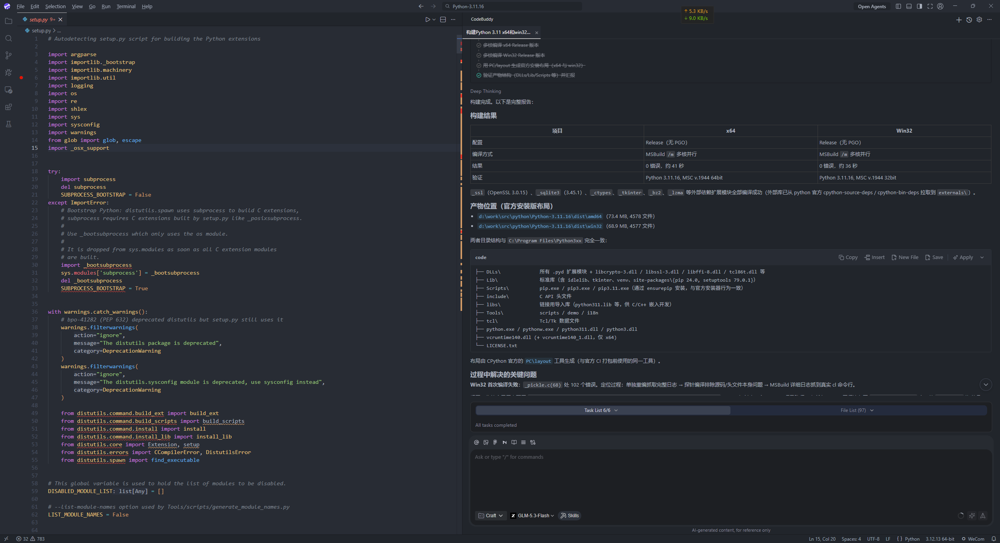
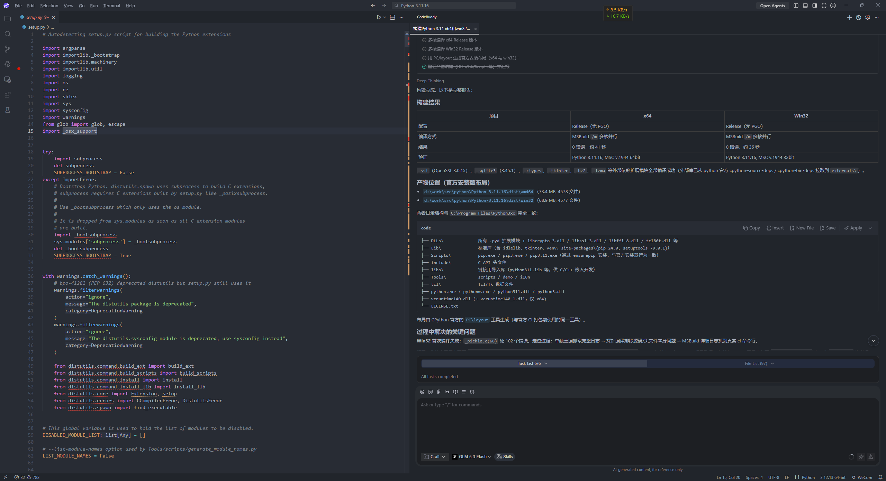

# One Dark Pro for CodeBuddy

One Dark Pro 主题的 CodeBuddy 移植件，与姊妹项目
[onedark-dsh-theme](https://github.com/songwenhao/onedark-dsh-theme)（DeepSeek Harness
版本）同一血统：三个忠实还原的暗色口味，One Dark 的暖灰蓝调贯穿整个工作台。

CodeBuddy CN 是 VS Code 分支（内核 1.106），主题即标准 VS Code 颜色主题扩展，
不涉及 dsh 那套 CJS 注入机制——本仓库的复杂度全部花在一处：**颜色键全覆盖补丁**。

## 三个口味

| 主题 | 编辑器背景 | 侧边栏背景 |
| --- | --- | --- |
| One Dark Pro | `#282c34` | `#21252b` |
| One Dark Pro Darker | `#23272e` | `#1e2227` |
| One Dark Pro Night Flat | `#16191d` | `#16191d` |

语法高亮三口味完全一致（上游如此），含语义高亮（`semanticHighlighting`）。

## 和市场版 One Dark Pro 的关系

本扩展的底子就是市场版 One Dark Pro 3.20.2（`zhuangtongfa.material-theme`，
vendored 在 `vendor/`），语法高亮、语义高亮与主工作台配色和市场版一致——
编辑器、标签栏、侧边栏、状态栏、CodeBuddy 聊天面板等主区域两边像素级相同，
这是"忠实还原"的自然结果。

区别只可能在 CodeBuddy 1.106 工作台读取、而市场版主题表未定义的 81 个颜色键
上：其中多数在 VS Code 的默认色注册表里是"引用其他颜色"的回落链（如
`panel.background` 缺省引用 `editor.background`），市场版同样回落出 One Dark
色；真正字面硬编码、两边确实不同的约 20 个键，都是次要表面的细微差别——
链接悬停色（#3794FF → #61afef）、进度条（#0E70C0 → #4d78cc）、错误前景
（#F48771 → #e06c75）、`#CCCCCC` 系灰度（→ `#abb2bf` 系），以及 widget/
菜单/侧栏边框从透明补成 #181a1f 发丝线等。

因此补丁表的意义是**保险网**而非改头换面：这些缺键若不补，会回落到
Dark Modern / Catppuccin 的字面值（CodeBuddy 默认暗色主题 "CodeBuddy Dark"
的底子是 Catppuccin Mocha），CodeBuddy 后续版本新增 UI 面板时风险只会变多。
生成器内置 `REQUIRED_KEYS` 断言：换新上游 vendored 文件重新生成时，
覆盖缺口会直接报错。

## 界面对比

同一工作区、同一布局下的对比——上图为本扩展，下图为市场版 One Dark Pro
3.20.2。主工作台看不出区别正是上一节的结论；差异在次要表面，需打开通知、
菜单、设置页等位置才能察觉。





## 目录结构

```
vendor/OneDark-Pro*.json        上游 One Dark Pro 3.20.2 原样副本（改动的事实来源）
scripts/gen-themes.mjs          生成器：vendored 表 + 覆盖补丁 → themes/
themes/*.color-theme.json       生成产物（扩展实际加载的文件）
```

改配色请改 `scripts/gen-themes.mjs` 后重新生成，不要手改 `themes/`。

## 重新生成主题

```bash
node scripts/gen-themes.mjs
```

## 打包 VSIX

```bash
npx @vscode/vsce package --allow-missing-repository --no-dependencies
```

## 安装到 CodeBuddy

命令行：

```bash
"C:\Users\danjing\AppData\Local\Programs\CodeBuddy CN\bin\buddycn.cmd" --install-extension onedark-codebuddy-theme-0.1.1.vsix
```

或在 CodeBuddy 扩展视图 `···` 菜单 → **从 VSIX 安装…**。

装完后 `Ctrl+K Ctrl+T` 打开颜色主题选择器，选
**One Dark Pro / One Dark Pro Darker / One Dark Pro Night Flat**。

## 许可

MIT。主题内容源自 [One Dark Pro](https://github.com/Binaryify/OneDark-Pro)（MIT）。
